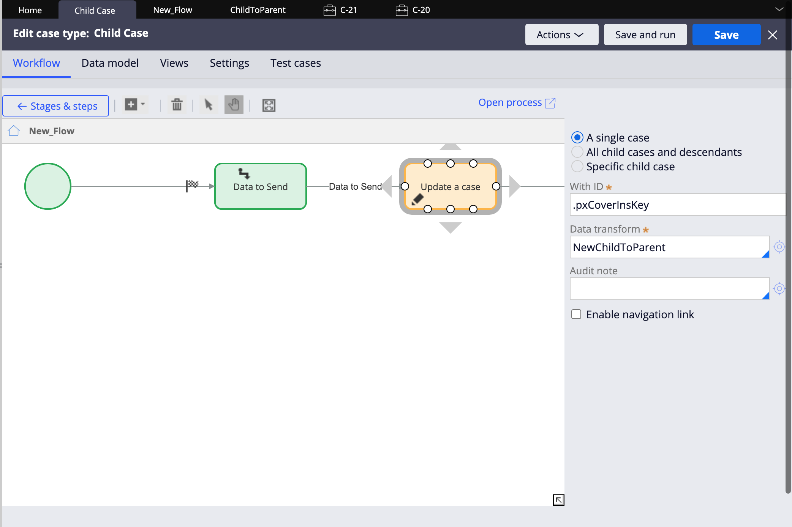
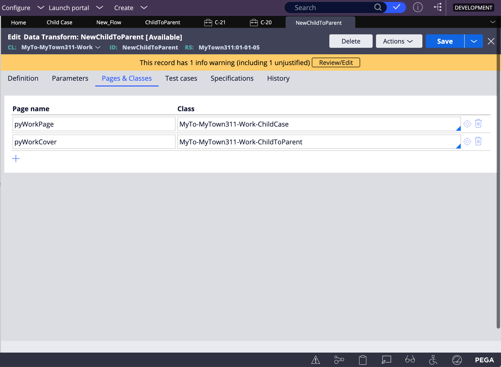
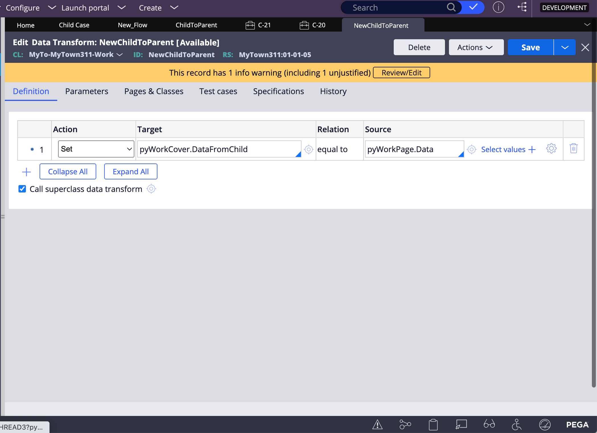
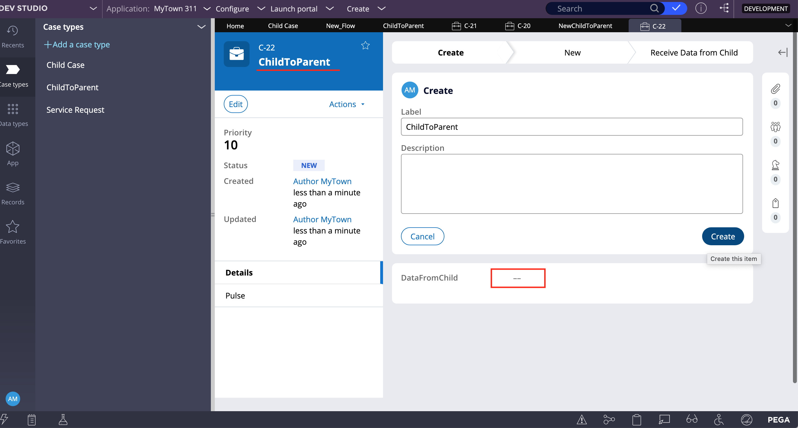
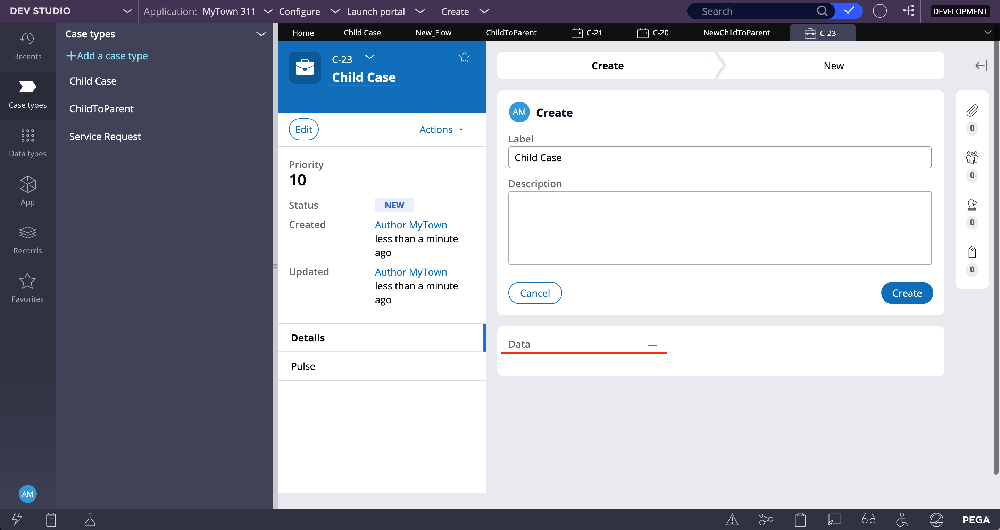
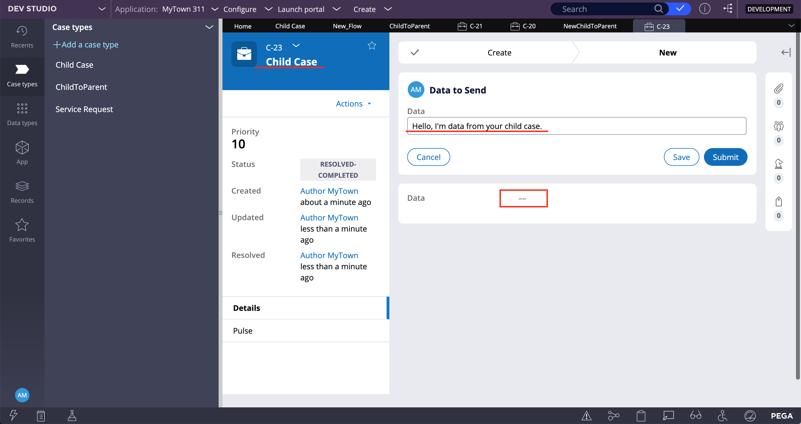
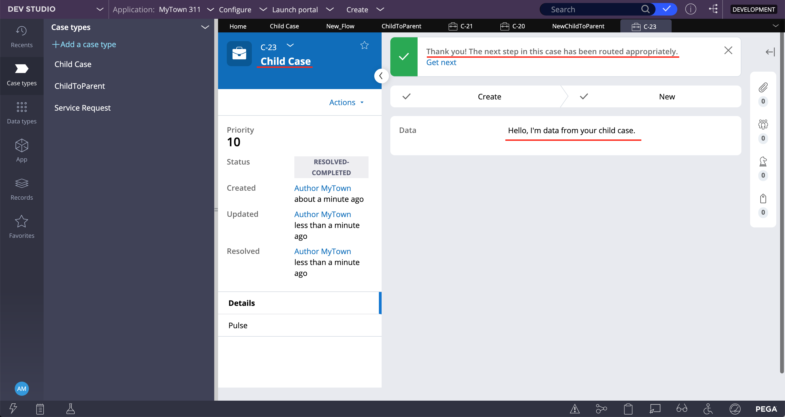
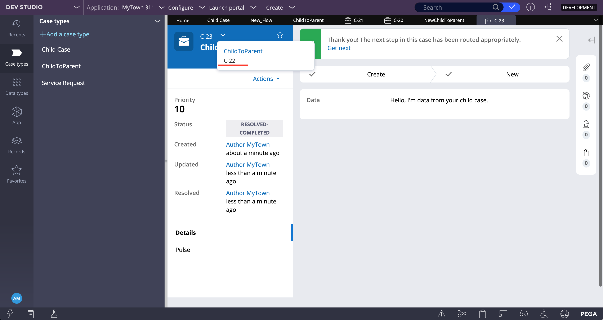
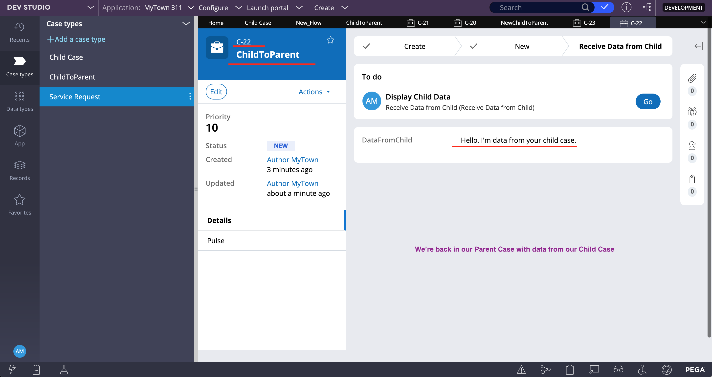

# Propagation through Data Transforms & Automation Shapes

## Propagating Data from Child to Parent

1. **Create Parent Case**
     - <u>2  Stages</u>
          - Stage (New)
               - Step: New (Blank)
               - Step: Create Child Case (Automation)
               - Step: Wait (Automation): **condition**: *until child case(s) resolve*
          - Stage (Display Child Data)
               - Step: Display Child Data
                    - 1 field: Data from Child -- Type: text(single line) --
2. **Create Child Case**
     - <u>1  Stages</u>
          - Stage (New)
               - Step: Data (Collect info) -- Set Case Status to *Resolved-Completed*
                    - 1 field: _Data To Send_ --Type: text (single line)
               - Step: Update Case (Automation) 
               > (ensures parent case is refreshed and new data is shown)
3. Child Case > Open Process > Configure **Update Case**

4. Run:

