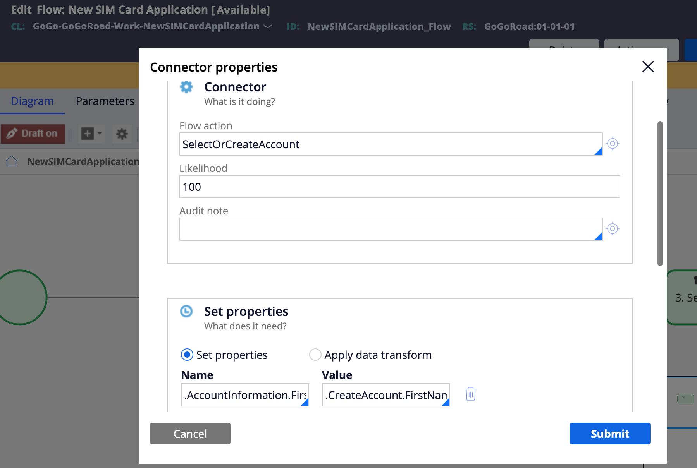

# Data Propagation Without Data Transforms

The following discussion (and example) explains how to move data from one property to another in Pega, without Data Transforms. This post focues on moving data from one property to another inside the *same* case type, because Pega already provides an easy way to propagate data in other scenarios (parent-to-child, or reverse).

In the Case Lifecycle Designer, first, open the assignment that contains the property (that is going to be set to another), and check `Set Properties` on the flow action leading away from the assignment shape.

This process is simpler than creating a DT to pass data from property-to-property, and it performs exactly the same.

### Use Case

Say you have a form, 'create account', which will at some point be saved as a new account (as the name suggests). But, the actual submission (saving the group of account details), happens a few case stages or steps down, in another step called "Submit account information" (before submission).

Not an issue.

Let's assume the group of account details is in a field group labeled "Account Information."

Using this technique, your entire configuration looks like this ...

Where **Name** defines the target property to be set, and **Value** determines the source property value used.

Simple. Right?

Note, using this technique, you're not limited to propagating one value to a property at a time.

The screenshot above is cropped poorly. **There is an option to "+ add" additional properties** beneath the gray cancel button.

The option to apply a data transform as you can see, is made available to you right next to set properties. Unless your data needs to be modified in some way, before propagating, these steps make data propagation very easy to do.
