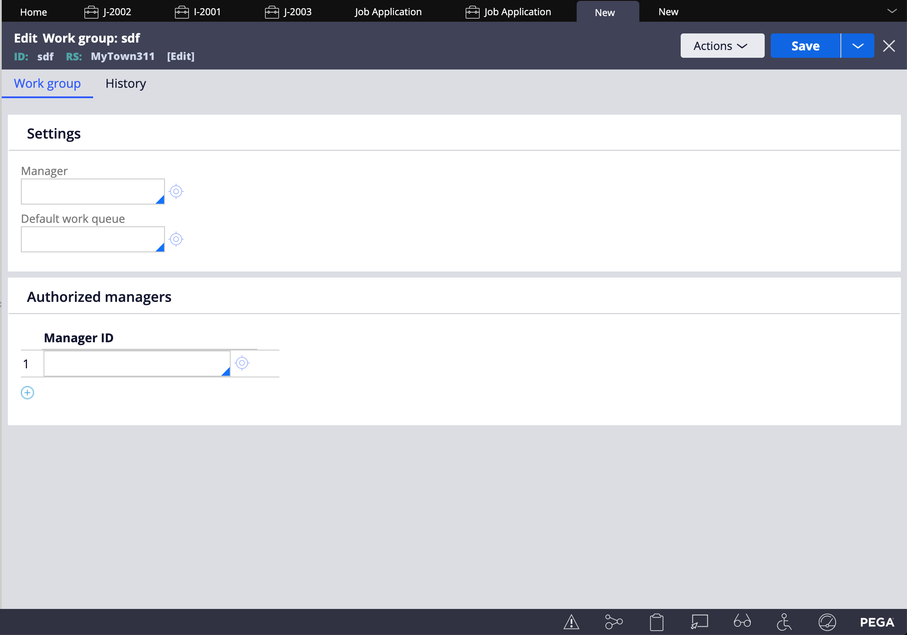

# <u>Pega 3-4</u>

## Routing

Routing is an automation, like other automations: Wait, Savable Data Page, Send Email.

Routing can be configured based upon different conditions: on Skill, Availability, Work Assigned (Group belonging to).

> Note: Collect Information steps are also referred to as Assignment Shapes in Routing.
>
> This is important, because it is only in steps like Collect Information, where a user may input or make changes to data in a case's lifecyle.

There are four types of routing:

* Work List Routing (Route to: an individual user)
* Work Queue (Route to: Team/Group)
* Business Logic (Route to: the above, based on more configurable conditions)
* Custom (Route to: Pega-defined routes)

Routing is configured under the same panel as *Configure View* in case lifecycles.

To route to an individual user, use the dropdown labeled (*Route to:*) located in any case's step settings to define which user is allowed to modify this step.

In the dropdown, you can select your desired routing type. The options will be similar to the four types of routing discussed.

* Specific User
* Current User
* Work Queue

Depending on the routing type you've selected, additional fields will appear.

If you've selected Specific User, for example, a field will appear for you specify which user this step should belong to.

To route to a group of individuals, or Work queue, you can select Work queue from the Route to dropdown, and assign the step to a Work queue.

Work queues are not groups themselves, but rather Work Groups belong to Work queues.

A group of workers (say delivery boys) will belong to a particular work queue (say deliveries, or delivery queue)

Like most objects in Pega, Work queues can be created in a number of different ways. An example:

1. Open App Explorer
2. Right click on the class pertaining to your case
3. Create > Organization > Work Group | Work Queue.

The creation windows for both queues and groups are very similar. The small differences are that a group has a Manager who as the title suggests, manages the group.

To use the Delivery Boys example, a manager may be the head delivery boy, or restaurant manager.

A Work queue has more advanced configurations. Organization Name, Division, and the Unit it belongs to. This is because a queue in essence is moreso owned by case types (which in Pega is a class, and therefore has scope).

**Work Group Creation**
</img>

**Work Queue Creation**
</img>