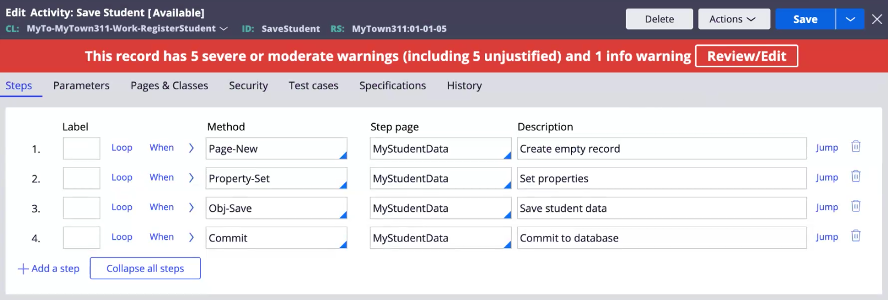
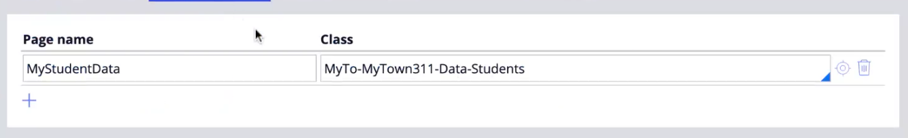
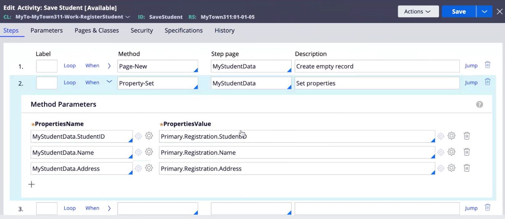
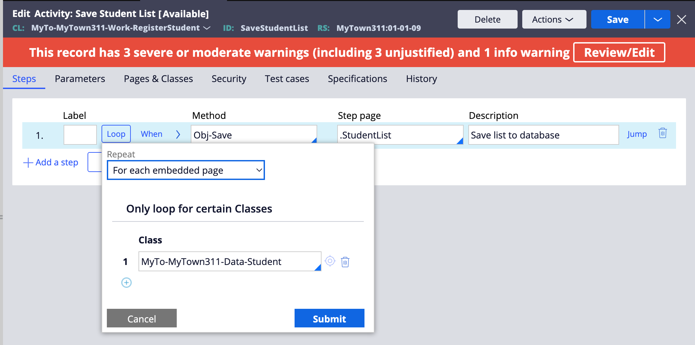

# <u>Pega 4-2</u>

## Activities  in Pega

Activity is one of Pega's Rules that performs jobs/tasks.

They contain steps (or steps). Written very much like an algorithm would be in most programming languages.

Activities in Pega are very useful, but it's not recommended that you use them often. The reason being, activities require you to **write your own code.**

This can introduce complexities in your app, if you do not write code that follows Pega standards.

If no other ruletype supports your requirements, then activities should be considered. In all other cases, using Pega's provided ruletypes is suggested.

For example, Pega offers Savable Data Pages to store data in applications internally.

When connecting to databases and saving data externally - you'll have to use activities.

|When to use Activities|When not to use Activities|
|-|-|
|Saving records to database(s) with special requirements: (|Declare expressions for data calculations|
|Deleting records from the database|Report definitions for database query|
|Background Processes|Data transform for data manipulations|
|To use the property-set message or page-set message| |

## Creating an Activity

Activity columns:

- label
- method
- step page
- description

|Label|Method|Step Page| description|jump|
|-|-|-|-|-|
|step name ( think of algorithms)|Predefined Pega methods (Call, Java, Connect)| Specifies which class the activity should affect (new pages can be added under > Pages & Classes.. The beginning class will be the primary page, and the Supporting class will become the secondary| description of the method| Specificies (conditionally) which step to jump to.

|loop|when|
|-|-|
|loop step continuously|set conditions required to run step|

Next to When, there is an arrow that displays the parameters for each method.

Additional configurations are provided as tabs (above the acivity creation window):

- Parameters
- Pages & Classes
- Security
- etc.

## Example

1. Create Case
2. Create Step (Save student)
3. Create view, define data type (student: student name, id)
4. Create Activity (save student)
5. Activity Step #1
    - Method: Page-new
    - Step Page: Savable Data page (configured in Pages & classes)
    - Description: creating an empty record.
6. Activity Step #2
    - Method: Property-Set
    - Same as Previous (Savable Data Page)
    - Description: Set properties
    Parameters: (Expand arrow right of `when`) > PropertyName: D_Datapage.StudentID, PropertyName: D_Datapage.StudentName, etc.
7. Activity Step #3
    - Method: Obj-Save
    - Step Page: *
    - Desc: Save student data
    - Method parameters:
    WriteNow[x], WithErrors[], OnlyIfNew[]
8. Activity Step #4
    - Method: Commit.
    - Step Page: *

Activities can be called from flow action rules:

Open Flow Action > Post Processing > Run Activity: ___________.

### Activity Example: Overview

### Activity Example: Data Page

### Activity Example: Property Set

### Activity Example: List Overview

> To resolve first list items not saving: Class > Data Model > Data Transform > pySetFieldDefaults > **Delete row labeled *"...yourDataType.(1)"**
