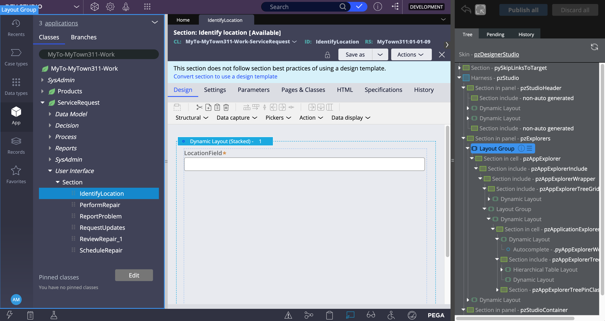

# <u>Pega 4-3</u>

## Pega User Interfaces and Basic Controls

The UI elements of Pega Platform include basic controls that you can use out of the box, these include:

- Autocomplete controls
- Buttons
- Charts
- Check boxes
- Drop-down lists
- Links
- Sliders
- Rich-text editors

## Dynamic UI design

Dynamic UI design is the practice of <u>designing a user interface to adapt according to user input.</u> When designing a dynamic user interface (UI), you control the fields that users see and interact with, according to specified conditions. Dynamic UI content is a key element of an intent-driven UI design.

---
(Dynamic UI Design)

> **Choices made by users <u>drive</u> what controls are displayed, so that only relevant fields are presented.**

---

For example, when submitting a `loan request`, customers specify their `marital status`. If customers select `married`, the application displays user entry fields for their partner.

## Dynamic Layouts

Types:

- Repeating Dynamic Layouts
- Dynamic Layouts

### Creating (Repeating) Dynamic Layouts

1. Open App Explorer
2. Case (Class) > User Interface > Section > Section rule
3. Convert to full section editor
4. Structural > (Repeating) Dynamic Layout

## Live UI Tool

In Dev Studio, see footer:

The Live UI Tool will appear. Its appearance is comparable to dev tools (right click browser window > inspect) in most browsers

When editting cases, you can select & open fields from the Live UI tree panel and edit them, without having to navigate to the particular section rule in your app explorer.
