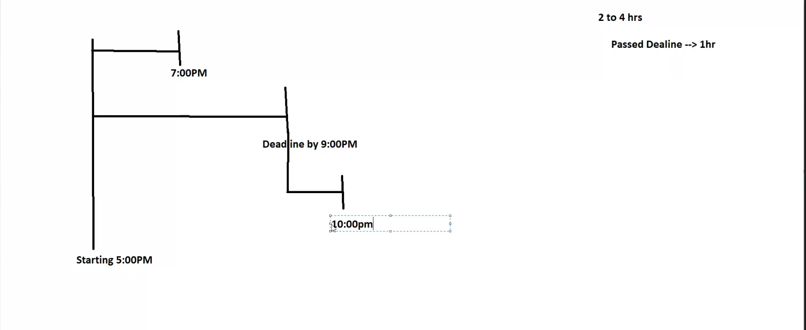

# Pega 5-2

## Service Level Agreements

Example: Loan applicaiton (your loan will be processed in 2-3 business days), Amazon orders (your order will ship in 1-2 business days)

SLA - a promise to deliver work within _some_ time.

SLAs enforce work to be completed on time.

- Goal: when work should be completed, actions configured will execute once
- Deadline: when work must be completed, actions configured will execute once
- Passed Deadline: when work has passed expected completion, actions configured will execute more than once



SLAs can be configured on Processes, Steps, Cases and Stages.

They can be configured to run off of Set Time intervals, Property-defined times, and dates.

Assignment Readiness is configured in three ways: Immediately, Dynamically defined on a property, Timed delay.

### Circumstancing

When there are multiple outcomes or multiple possibilities to a single instance

> Rules behaving differently under different conditions - this can be configured by **property** or other focal points.

To circumstance a rule, you have to create a base rule to define expected behavior.

Pega uses the base rule unless the circumstanced version is more appropriate.

When customizing rule behavior, circumstancing can be configured on Single variant, and multi variant properties:

- Single properties (Property Type)
- Multiple properties (Property Type & User Region)

When configuing multiple variant circumstances, items necessary:

- Circumstance template -> properties need to be added
- Circumstance definition -> property values need to be added

Circumstancing rules can only be focused upon:

- Date properties (specific date needs to be specified)
- As of date (references system date)

### Configuring Circumstances

1. create case (Single value circumstancing)
2. create step (select loan) -> configure view -> Add field (loan Type, picklist), add choices
3. create 2nd step (loan interest rate) -> configure view -> Add field (DD)
4. App explorer > {Case} > User Interface > Section > Loan interest rate
5. Convert to full section editor
6. Delete property "DD"
7. Data display > drag & drop Dynamic layout (label) > set properties (value: rate of interest) > Save your work
8. Create case
9. Toggle `use checkout` in your current ruleset
10. In rule, Save As > Click dropdown arrow > Specialize by circumstance
11. Circumstance by Property & Date
12. Property -> .LoanType, Value -> "Car Loan", "Education Loan" etc..
13. Create & open
14. Configure section rule however you like, run case. You'll see that the rule changes its behavior based upon your newly created circumstance

## Check in rules in bulk

1. Search bar, blue check, click, bulk actions, open window, select all, give comments (check-in comments), (check-in) start

---

```md
Observation: There aren't many situations where a circumstance solves a problem that a Decision Table or comparable rules could not.

Response: "If if you have 20-30 conditions, writing a big decision table can be hectic. Additionally, a Decision Table will evaluate each and every condition until a match is met, which takes more time.

Fix: Use a data reference to lookup key/value pairs.

Response: "Yes, but even that is **costly**. You have to create additional data pages each call"

Is the cost of a few more operations (through calling new data pages) truly **more expensive** than the added complexities a Circumstance brings?
```
